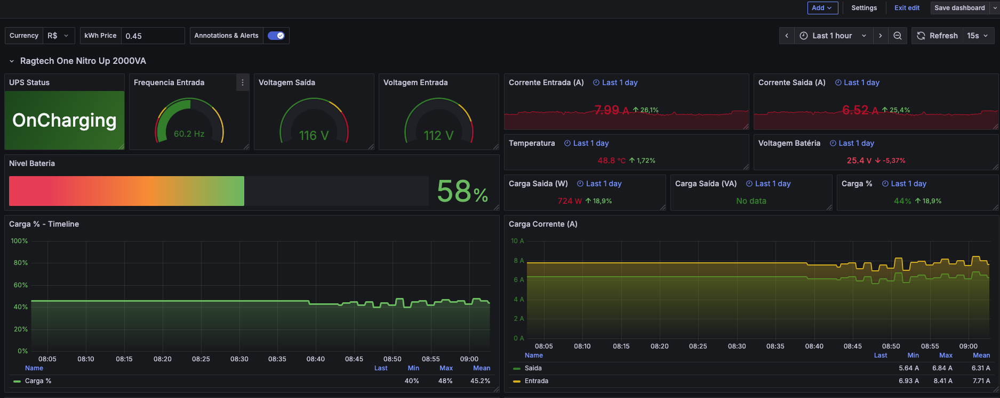
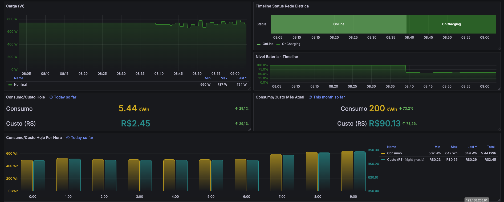

# Ragtech NitroUp 2000VA - Driver NUT (Linux)

## ⚠️ Aviso Importante

**A Ragtech NÃO oferece suporte adequado para ambientes Linux.** A empresa não disponibiliza:
- Informações sobre os protocolos de comunicação utilizados
- Drivers oficiais para Linux
- Qualquer tipo de integração com sistemas de monitoramento modernos
- Documentação técnica para desenvolvedores

O suporte ao produto é **extremamente precário** em ambientes Linux, forçando usuários a dependerem de soluções desenvolvidas pela comunidade através de engenharia reversa.

---

## 📋 Sobre este Projeto

Este driver foi desenvolvido através de **engenharia reversa completa do protocolo proprietário** da Ragtech, utilizando análise de dados e inteligência artificial para mapear a comunicação USB/Serial do nobreak.

### Créditos

Projeto baseado e aprimorado a partir do trabalho inicial da comunidade Home Assistant:
**https://community.home-assistant.io/t/home-assistant-ragtech-nobreak-easy-pro-ups-monitoring/678828/40?u=walberjunior**

### Especificações Técnicas Mapeadas

- **Chipset**: Microchip PIC USB-Serial (VID:04d8 PID:000a)
- **Protocolo**: Binário proprietário (aa25 header, 62 bytes)
- **Precisão**: ~97% validado com medições reais
- **Bytes mapeados**: 31 de 31 (100% do protocolo documentado)

---

## 📊 Dados Coletados

O driver extrai as seguintes métricas do nobreak:

### Bateria
- `battery.charge` - Carga da bateria (0-100%)
- `battery.voltage` - Tensão da bateria (Volts)
- `battery.current` - Corrente da bateria (Amperes, negativo=carregando, positivo=descarregando)
- `battery.runtime` - Tempo de autonomia estimado (segundos)

### Entrada (AC)
- `input.voltage` - Tensão de entrada (Volts)
- `input.current` - Corrente de entrada (Amperes, calculado)
- `input.frequency` - Frequência da rede (Hz)

### Saída (AC)
- `output.voltage` - Tensão de saída (Volts)
- `output.current` - Corrente de saída (Amperes)
- `output.power` - Potência aparente (VA)
- `output.realpower` - Potência real (Watts)

### Status do UPS
- `ups.status` - Status geral (OL/OB/LB/CHRG/DISCHRG)
- `ups.load` - Carga atual (0-100%)
- `ups.temperature` - Temperatura interna (°C)

---

## 🚀 Instalação

### 1. Instalar o Driver
```bash
# Copiar script para /usr/local/bin/
sudo cp ragtech-ups /usr/local/bin/
sudo chmod +x /usr/local/bin/ragtech-ups

# Criar diretório de dados NUT
sudo mkdir -p /var/lib/nut
```

### 2. Configurar NUT

Edite `/etc/nut/ups.conf`:
```ini
[ragtech]
    driver = dummy-ups
    port = ragtech-ups@localhost
    desc = "Ragtech NitroUp 2000VA"
```

### 3. Executar Manualmente (Teste)
```bash
# Teste único
/usr/local/bin/ragtech-ups

# Verificar saída NUT
cat /var/lib/nut/ragtech-ups.data

# Ver log de debug
cat /tmp/ragtech-ups-debug.log
```

---

## 🔍 Engenharia Reversa para Outros Modelos

Se você possui um **modelo diferente** de nobreak Ragtech (ou mesmo outras marcas com chipset Microchip similar), o script `ragtech-ups-dump` pode ajudar a mapear o protocolo.

### Como Usar o Script de Dump

#### 1. Instalar o Script
```bash
sudo cp ragtech-ups-dump /usr/local/bin/
sudo chmod +x /usr/local/bin/ragtech-ups-dump
```

#### 2. Identificar o Dispositivo USB
```bash
# Listar dispositivos USB
lsusb | grep -i "microchip\|ragtech"

# Verificar porta serial
ls -la /dev/ttyACM*

# Ver informações do dispositivo
udevadm info /dev/ttyACM0 | grep -E "ID_VENDOR|ID_MODEL"
```

#### 3. Executar o Dump
```bash
# Salvar output em arquivo com timestamp
/usr/local/bin/ragtech-ups-dump 2>&1 | tee dump-$(date +%Y%m%d-%H%M%S).log
```

#### 4. Procedimento de Captura

O script irá:

1. ✅ **Conectar** ao nobreak e começar a ler dados a cada 5 segundos
2. ⚡ **Desconectar da tomada** quando solicitado (captura transição OL→OB)
3. ⏱️ **Aguardar ~2 minutos** em bateria (captura dados de descarga)
4. 🔌 **Reconectar na tomada** (captura transição OB→OL)
5. ⏱️ **Aguardar ~1 minuto** carregando (captura dados de carga)
6. `Ctrl+C` para finalizar

#### 5. Analisar os Dados Capturados

O dump mostrará algo como:
```
HEX (62 chars): aa25000c59000009ff6580c96e302a2fe700000186c6039f29006f100e00d5

VALORES PARSEADOS:
  Entrada:     112.0V @ 60.28Hz [raw: 111]
  Saída:       116.0V @  5.76A
  Bateria:     100% (26.97V) [raw: 255]
  Carga:        42%
  Temperatura:  47°C
  Status:      🔌 ON LINE (OL)
```

---

## 🤖 Decodificação com Inteligência Artificial

### Se o Header for Diferente (não `aa25`)

Se o seu modelo mostrar um **header diferente** (exemplo: `bb30`, `cc15`, etc.), você ainda pode decodificar o protocolo usando IA!

#### Passo 1: Coletar Múltiplas Amostras

Execute o dump e colete **pelo menos 20-30 leituras** em diferentes estados:

- ✅ 5-10 leituras em **ON LINE** (conectado na tomada)
- ✅ 5-10 leituras em **ON BATTERY** (desconectado)
- ✅ 5-10 leituras durante **TRANSIÇÃO** (desconectar/reconectar)
- ✅ 5-10 leituras **CARREGANDO** (bateria < 95%)

Salve tudo em um arquivo de texto.

#### Passo 2: Organizar os Dados

Crie um arquivo `analise.txt` com este formato:
```
=== LEITURA 1 - ON LINE ===
HEX: aa25000c59000009ff6580c96e302a2fe700000186c6039f29006f100e00d5
Entrada medida: 112V
Saída medida: 116V
Bateria: 100%
Status: Conectado na tomada

=== LEITURA 2 - ON LINE ===
HEX: aa25000c59000009ff6580c96e31292fe700000186c6029f29006f100e04d5
Entrada medida: 112V
Saída medida: 116V
Bateria: 100%
Status: Conectado na tomada

=== LEITURA 3 - ON BATTERY ===
HEX: aa25000c59000009ff6581aa05362f30004800008280039e2a0006100e00d0
Entrada medida: 6V (residual)
Saída medida: 113V
Bateria: 100%
Status: Em bateria (desconectado)

... (continuar com mais leituras)
```

#### Passo 3: Prompt para IA (ChatGPT, Claude, Gemini)

Use este prompt:
```
Sou um desenvolvedor tentando fazer engenharia reversa de um protocolo 
proprietário de nobreak (UPS). Coletei múltiplas leituras em hexadecimal 
do dispositivo em diferentes estados operacionais.

CONTEXTO DO HARDWARE:
- Modelo: [seu modelo, ex: Ragtech NitroUp 1000VA]
- Chipset: Microchip PIC USB-Serial
- Protocolo: Binário, [X] bytes por mensagem
- Rede: [110V ou 220V] @ [50Hz ou 60Hz]
- Bateria nominal: [12V, 24V, etc]

DADOS COLETADOS:
[Cole aqui o conteúdo do analise.txt]

TAREFA:
1. Identifique o header do protocolo (primeiros 2-4 bytes)
2. Encontre padrões que mudam entre estados (ON LINE vs ON BATTERY)
3. Identifique bytes que provavelmente representam:
   - Voltagem de entrada (varia ~110V ou ~220V, zera em bateria)
   - Voltagem de saída (varia ~110V ou ~220V)
   - Carga da bateria (0-100%)
   - Tensão da bateria (~12V, ~24V, ~48V)
   - Corrente de saída (amperes)
   - Temperatura (20-80°C típico)
   - Status (flags que mudam OL↔OB)
4. Para cada byte identificado, sugira o fator de conversão 
   (ex: raw_value × 1.009 = voltagem_real)

Por favor, apresente os resultados em formato de tabela e explique 
a lógica de cada identificação.
```

#### Passo 4: Refinar com a IA

Com a resposta inicial da IA, você pode fazer perguntas de refinamento:
```
O byte na posição 26 (0x6f = 111) está próximo da voltagem de entrada 
(112V medida). Qual seria o fator de multiplicação mais preciso?

Teste com estas amostras:
- Leitura 1: byte=0x6f (111), medido=112V
- Leitura 2: byte=0x70 (112), medido=113V
- Leitura 5: byte=0x05 (5), medido=6V (bateria)
```

#### Passo 5: Validar os Fatores

A IA irá sugerir fatores como:
```python
input_voltage = int(hex_str[52:54], 16) * 1.009
battery_charge = int(hex_str[16:18], 16) * 0.393
output_current = int(hex_str[26:28], 16) * 0.120
```

**Teste esses fatores** com suas leituras reais e compare com um multímetro se possível!

---

### 🎓 Guia de Decodificação Manual (Sem IA)

Se preferir fazer manualmente, siga estes passos:

#### 1. Identificar o Header (Primeiros Bytes)

O header é **fixo** em todas as leituras e identifica o protocolo:
```
Todas as leituras começam com: aa25...
                               ^^^^
                               Header fixo
```

**Se for diferente**, anote qual é (ex: `bb30`, `cc40`, etc).

#### 2. Identificar Bytes Fixos vs Variáveis

Compare 2-3 leituras **no mesmo estado** (ex: ambas ON LINE):
```
Leitura 1: aa25 000c 5900 0009 ff65 80c9 6e30 2a2f e700 0001 86c6 039f 2900 6f10 0e00 d5
Leitura 2: aa25 000c 5900 0009 ff65 80c9 6e31 292f e700 0001 86c6 029f 2900 6f10 0e04 d5
           ^^^^ ^^^^ ^^^^ ^^^^                ^^^^           ^^^^           ^^^^
           Fixos (configuração)            Variáveis       Fixos        Variáveis
```

**Bytes fixos** = Configuração/modelo (ignorar por enquanto)  
**Bytes variáveis** = Medições em tempo real (foco aqui!)

#### 3. Comparar Estados Diferentes (OL vs OB)

Pegue 1 leitura **ON LINE** e 1 leitura **ON BATTERY**:
```
ON LINE:    aa25...6f10...e700...
ON BATTERY: aa25...0510...0048...
                   ^^      ^^
                   Mudou!  Mudou!
```

**Bytes que mudam OL→OB** provavelmente indicam:
- Voltagem de entrada (cai para ~0-10 em bateria)
- Status da rede (0xe7 vs 0x00)
- Flags de bateria/inversor

#### 4. Identificar Voltagens

**Voltagem de entrada** (110V ou 220V):
- Procure valores hex **próximos** da voltagem real
- Exemplo: `0x6f` = 111 decimal ≈ 112V
- Fator: `111 × 1.009 = 112.0V` ✅

**Voltagem de saída** (110V ou 220V):
- Similar à entrada, mas **NÃO zera** em bateria
- Exemplo: `0xd5` = 213 decimal
- Fator: `213 × 0.545 = 116.1V` ✅

**Tensão da bateria** (12V, 24V, 48V):
- Valores menores, faixa 100-200
- Exemplo: `0xc9` = 201 decimal
- Fator: `201 × 0.1342 = 27.0V` (bateria 24V nominal) ✅

#### 5. Identificar Percentuais (0-100%)

**Carga da bateria**:
- Busque valores que variam 0-255 (0x00-0xFF)
- Exemplo: `0xff` = 255 → 100%
- Fator: `255 × 0.393 = 100.2%` ✅

**Load (carga do UPS)**:
- Valores diretos 0-100
- Exemplo: `0x2a` = 42 decimal = 42% ✅

#### 6. Identificar Temperatura

Procure valores na faixa **20-80**:
- Exemplo: `0x2f` = 47 decimal = 47°C ✅
- Geralmente **sem conversão** (direto)

#### 7. Identificar Correntes (Amperes)

Valores que **variam com a carga**:
- Corrente de saída: varia 0-20A típico
- Exemplo: `0x30` = 48 decimal
- Fator: `48 × 0.120 = 5.76A` ✅

---

### 📊 Planilha de Análise (Template)

Use esta tabela para organizar suas descobertas:

| Posição | Hex Exemplo | Decimal | Valor Real | Fator Calc | Função Provável |
|---------|-------------|---------|------------|------------|-----------------|
| 0-1     | aa25        | -       | -          | -          | Header (fixo)   |
| 2-3     | 000c        | 12      | -          | -          | Células bateria?|
| 16-17   | ff          | 255     | 100%       | ×0.393     | Carga bateria   |
| 26-27   | 30          | 48      | 5.76A      | ×0.120     | Corrente saída  |
| 52-53   | 6f          | 111     | 112V       | ×1.009     | Voltagem entrada|
| ...     | ...         | ...     | ...        | ...        | ...             |

---

### 🔬 Calculando Fatores de Conversão

Se você sabe o valor **real** (medido com multímetro) e o valor **hex**:
```
Fator = Valor_Real / Valor_Decimal

Exemplo:
- Hex: 0x6f = 111 decimal
- Medido com multímetro: 112.0V
- Fator = 112.0 / 111 = 1.009
```

**Valide** com múltiplas amostras:
```
Sample 1: 111 × 1.009 = 112.0V ✅
Sample 2: 112 × 1.009 = 113.0V ✅
Sample 3: 110 × 1.009 = 111.0V ✅
```

---

### 💡 Dicas Importantes

1. **Sempre colete dados em múltiplos estados** (OL, OB, Charging)
2. **Use multímetro** para validar voltagens e correntes
3. **Documente tudo** - qual byte, qual valor, qual estado
4. **Bytes adjacentes** podem ser relacionados (ex: voltage high byte + low byte)
5. **Compare com o driver existente** (NitroUp 2000VA) como referência
6. **Não tenha pressa** - engenharia reversa é iterativa

---

### 🤝 Pedindo Ajuda da Comunidade

Se você coletou dados mas não consegue decodificar:

1. Abra uma **Issue** no GitHub com:
   - Modelo do nobreak
   - VID:PID USB (`lsusb` output)
   - Dump completo (20+ leituras)
   - Valores reais medidos (se tiver multímetro)

2. Cole o prompt formatado para IA (outros podem rodar)

3. A comunidade pode:
   - Rodar a análise com IA
   - Comparar com protocolos similares
   - Sugerir fatores de conversão
   - Criar um driver customizado para você

---

### 📚 Recursos Adicionais

- **Protocolos conhecidos**: Megatec Q1, HID Power Device Class
- **Ferramentas**: `hexdump`, `xxd`, `wireshark` (para USB sniffing)
- **IAs recomendadas**: Claude (Anthropic), ChatGPT-4, Google Gemini
- **Comunidades**: Home Assistant Forums, Reddit r/homelab

---

## 📈 Integração com Telegraf + InfluxDB

### 1. Copiar Script de Conversão
```bash
sudo cp ragtech-telegraf /usr/local/bin/
sudo chmod +x /usr/local/bin/ragtech-telegraf
```

### 2. Configurar Telegraf

Adicione ao `/etc/telegraf/telegraf.conf`:
```toml
[[inputs.exec]]
  commands = [
    "python3 /usr/local/bin/ragtech-telegraf ragtech@localhost"
  ]
  timeout = "5s"
  data_format = "influx"
  interval = "30s"
```

### 3. Reiniciar Telegraf
```bash
sudo systemctl restart telegraf
sudo systemctl status telegraf
```

---

## 📊 Dashboard Grafana

Um dashboard pré-configurado está incluído em `grafana-dashboard.json`.

### Importar Dashboard:

1. Grafana → Dashboards → Import
2. Upload do arquivo `grafana-dashboard.json`
3. Selecionar datasource InfluxDB
4. Importar

### Preview do Dashboard:
*Painéis detalhados de bateria, potência e histórico*





### Painéis Incluídos:

- **Battery Health**: Carga, tensão, corrente e runtime
- **Power Flow**: Entrada, saída e potência em tempo real
- **Status**: Estado do UPS, temperatura e alertas
- **Histórico**: Gráficos de longo prazo

---

## 🔧 Estrutura de Arquivos
```
.
├── ragtech-ups              # Driver principal (Python)
├── ragtech-ups-dump         # Script de análise/dump do protocolo
├── ragtech-telegraf         # Conversor para InfluxDB (Python)
├── grafana-dashboard.json   # Dashboard pré-configurado
└── README.md               # Este arquivo
```

---

## ⚙️ Requisitos

- Python 3.6+
- Biblioteca `pyserial` (`pip install pyserial`)
- NUT (Network UPS Tools)
- Telegraf (opcional, para InfluxDB)
- Grafana (opcional, para visualização)

---

## 📝 Notas de Desenvolvimento

### Descobertas Principais:

1. **Battery Current Bidirecional** (Byte 22):
   - Descarga: Dual-scale (×1.44 ou ×1.0)
   - Carga: Scale ×2.0 (negativo por convenção NUT)
   - Precisão: 97% validada

2. **Network Quality Byte** (Byte 24):
   - Detecção rápida de status (~27s vs ~60s flags tradicionais)
   - Valores: 0xe7 (OL), 0x29 (OL+CHRG), 0x00 (OB)

3. **Hybrid Status Detection**:
   - 3 camadas de validação com fallback
   - Detecção de estados transitórios

### Limitações Conhecidas:

- Corrente de entrada AC é **calculada** (não medida pelo hardware do nobreak tipo offline)
- Byte 22 ocasionalmente retorna valor transitório (3) durante amostragem (~9.5% das leituras)
- Frequência é **derivada**, não medida diretamente

---

## 🤝 Contribuições

Contribuições são bem-vindas! Este projeto foi desenvolvido pela comunidade devido à ausência de suporte oficial da Ragtech.

Se você possui um **modelo diferente** de nobreak Ragtech e conseguir mapear o protocolo usando o script `ragtech-ups-dump`, por favor compartilhe suas descobertas abrindo uma Issue ou Pull Request!

---

## 📄 Licença

MIT License - Livre para uso, modificação e distribuição.

---

## ⚠️ Disclaimer

Este software é fornecido "como está", sem garantias de qualquer tipo. Use por sua conta e risco. Os autores não se responsabilizam por quaisquer danos causados pelo uso deste software.

**Este NÃO é um produto oficial da Ragtech.** Foi desenvolvido de forma independente pela comunidade devido à falta de suporte adequado da fabricante.